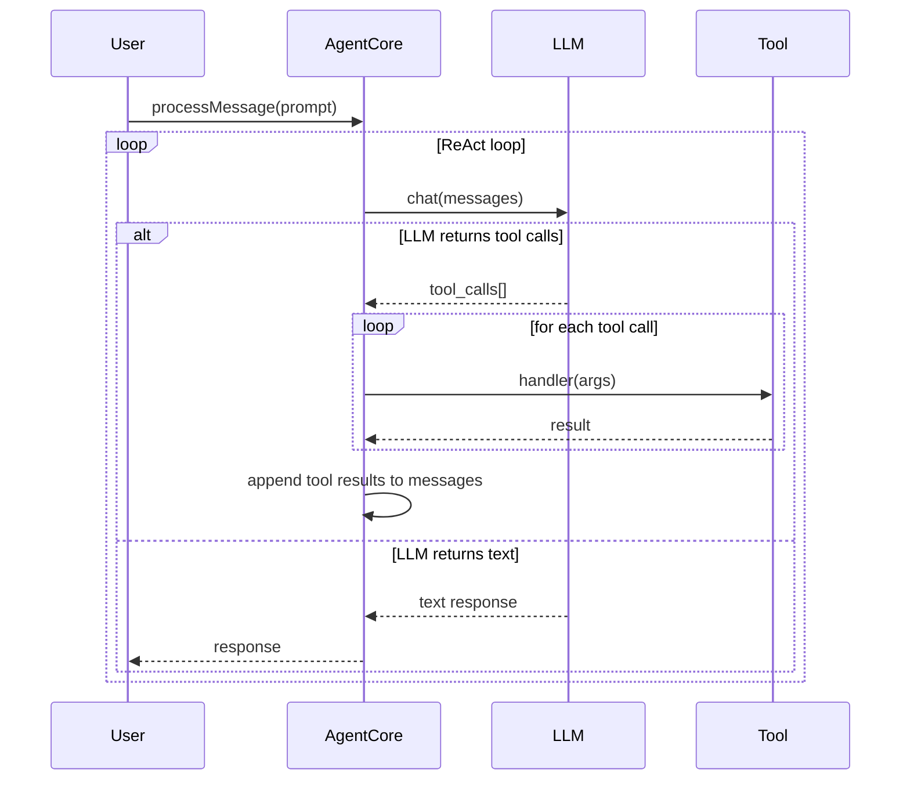
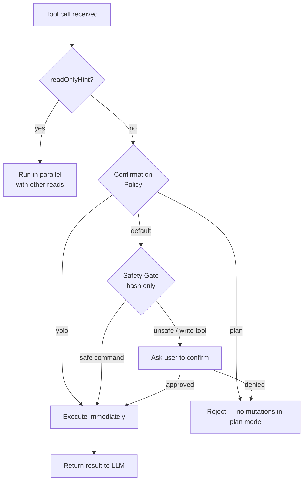
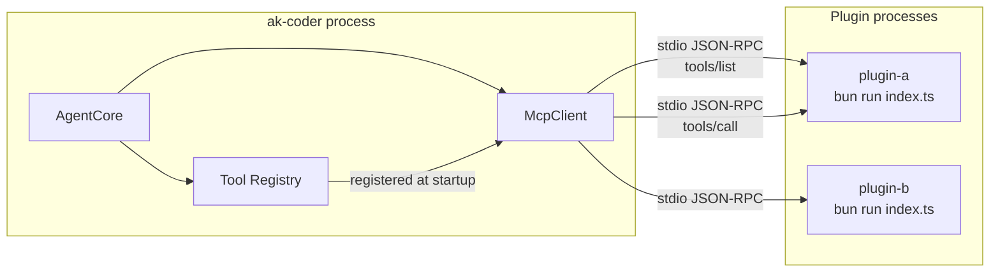
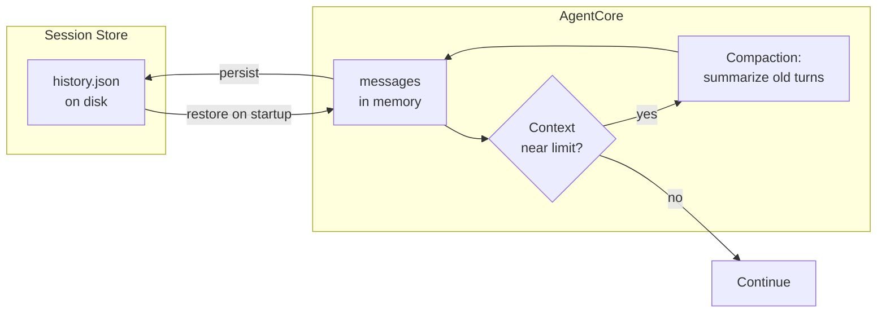
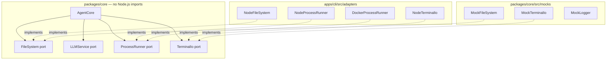

# Public Release Implementation Plan

> **For agentic workers:** REQUIRED SUB-SKILL: Use superpowers:subagent-driven-development (recommended) or superpowers:executing-plans to implement this plan task-by-task. Steps use checkbox (`- [ ]`) syntax for tracking.

**Goal:** Ship ak-coder as a public open-source project on GitHub with Docusaurus docs on GitHub Pages, published to npm as `@algiras/ak-coder`, with full CI/CD pipelines.

**Architecture:** Docusaurus site lives in `website/` at the repo root, built and deployed to GitHub Pages via GitHub Actions on every push to `main`. The CLI package is renamed and published to npm on version tags. Three GitHub Actions workflows handle CI (tests), docs deploy, and npm publish separately.

**Tech Stack:** Bun, TypeScript, Docusaurus 3, GitHub Actions, npm (`@algiras` scope)

---

## File Map

**Create:**
- `README.md` — root hero + quick start + features + provider table
- `website/` — full Docusaurus 3 site
- `website/docusaurus.config.ts` — site config (GitHub Pages URL, navbar, footer)
- `website/sidebars.ts` — sidebar structure
- `website/package.json` — Docusaurus dependencies
- `website/tsconfig.json` — TypeScript config for Docusaurus
- `website/static/.nojekyll` — disable Jekyll on GitHub Pages
- `website/docs/getting-started/installation.md`
- `website/docs/getting-started/configuration.md`
- `website/docs/getting-started/first-run.md`
- `website/docs/tools/index.md`
- `website/docs/tools/read-write.md`
- `website/docs/tools/bash.md`
- `website/docs/tools/search.md`
- `website/docs/tools/planning.md`
- `website/docs/providers/index.md`
- `website/docs/providers/ollama.md`
- `website/docs/providers/openrouter.md`
- `website/docs/providers/others.md`
- `website/docs/plugins/index.md`
- `website/docs/plugins/building.md`
- `website/docs/plugins/skills.md`
- `website/docs/evals/index.md`
- `website/docs/evals/writing-evals.md`
- `website/docs/evals/running.md`
- `website/docs/adrs/` — symlinked or copied from `docs/adrs/`
- `.github/workflows/docs.yml` — build + deploy Docusaurus to GitHub Pages
- `.github/workflows/publish.yml` — npm publish on `v*` tag

**Modify:**
- `apps/cli/package.json` — rename to `@algiras/ak-coder`, add `bin`, remove `"private"`
- `.github/workflows/ci.yml` — add `--frozen-lockfile`, add typecheck step
- `package.json` (root) — add `website` workspace exclusion (Docusaurus manages its own deps)

---

## Task 1: Rename CLI package and add bin entry

**Files:**
- Modify: `apps/cli/package.json`

- [ ] **Step 1: Update package.json**

Replace the entire `apps/cli/package.json` with:

```json
{
  "name": "@algiras/ak-coder",
  "version": "0.1.0",
  "description": "A hackable, hexagonal-architecture LLM agent harness for the terminal",
  "keywords": ["ai", "agent", "llm", "cli", "terminal", "ollama", "openai"],
  "license": "MIT",
  "repository": {
    "type": "git",
    "url": "https://github.com/Algiras/ak-coder.git"
  },
  "homepage": "https://algiras.github.io/ak-coder",
  "main": "src/index.ts",
  "bin": {
    "ak-coder": "src/index.ts"
  },
  "scripts": {
    "dev": "bun run src/index.ts"
  },
  "dependencies": {
    "@ak-coder/core": "workspace:*",
    "@claude-code-kit/ink-renderer": "^0.3.1",
    "@claude-code-kit/ui": "^0.3.1",
    "@types/react": "^19.2.15",
    "ink": "^7.0.3",
    "react": "^19.2.6"
  }
}
```

- [ ] **Step 2: Verify bun install still works**

```bash
bun install
```

Expected: no errors, lockfile updated.

- [ ] **Step 3: Commit**

```bash
git add apps/cli/package.json bun.lock
git commit -m "feat(cli): rename package to @algiras/ak-coder, add bin entry"
```

---

## Task 2: Update CI workflow

**Files:**
- Modify: `.github/workflows/ci.yml`

- [ ] **Step 1: Replace ci.yml content**

```yaml
name: CI

on:
  push:
    branches: [ main ]
  pull_request:
    branches: [ main ]

jobs:
  build-and-test:
    runs-on: ubuntu-latest

    steps:
      - name: Checkout Code
        uses: actions/checkout@v4

      - name: Setup Bun
        uses: oven-sh/setup-bun@v2
        with:
          bun-version: latest

      - name: Install Dependencies
        run: bun install --frozen-lockfile

      - name: Typecheck
        run: bunx tsc --noEmit -p packages/core/tsconfig.json

      - name: Run Tests with Coverage Check
        run: bun run test:coverage:check
```

- [ ] **Step 2: Commit**

```bash
git add .github/workflows/ci.yml
git commit -m "ci: add --frozen-lockfile and typecheck step"
```

---

## Task 3: Write README.md

**Files:**
- Create: `README.md`

- [ ] **Step 1: Create README.md**

```markdown
# ak-coder

**A hackable LLM agent harness for the terminal.**

[](https://github.com/Algiras/ak-coder/actions/workflows/ci.yml)
[](https://www.npmjs.com/package/@algiras/ak-coder)
[](LICENSE)

ak-coder is an open-source coding agent you can run locally, fork, and extend. It connects to any OpenAI-compatible LLM (Ollama, OpenRouter, Gemini, Groq, DeepSeek) and gives it a full set of developer tools — file read/write, bash, semantic search, planning mode, sub-agents, and more.

**[Documentation →](https://algiras.github.io/ak-coder)**

---

## Quick Start

**With Ollama (free, local):**

```bash
# 1. Install Ollama and pull a model
brew install ollama
ollama pull gemma3:4b

# 2. Run ak-coder
bunx @algiras/ak-coder
```

**With OpenRouter (cloud, free tier available):**

```bash
OPEN_ROUTER_KEY=your_key bunx @algiras/ak-coder
```

---

## Features

- **15 built-in tools** — `read_file`, `write_file`, `str_replace`, `patch_file`, `bash`, `glob`, `grep_search`, `semantic_search`, `list_directory`, `web_fetch`, `delegate_task`, `plan`, and more
- **Multi-provider** — Ollama, OpenRouter, Gemini, Groq, DeepSeek, any OpenAI-compatible endpoint
- **Hexagonal architecture** — core agent is fully decoupled from I/O; every component is independently testable
- **Plugin system** — extend with local MCP servers via `plugin.json`
- **Skills** — custom slash commands via `SKILL.md` files
- **Plan mode** — structured planning without mutations
- **Sub-agents** — delegate tasks to parallel agent instances
- **Eval harness** — LLM-as-judge evaluation suite with 18 eval cases

---

## Providers

| Provider | Model example | Setup |
|----------|--------------|-------|
| **Ollama** (local) | `gemma3:4b`, `llama3.2` | `brew install ollama && ollama pull gemma3:4b` |
| **OpenRouter** | `google/gemma-3-27b-it:free` | `OPEN_ROUTER_KEY=...` |
| **Gemini** | `gemini-1.5-flash` | Set API key in config |
| **Groq** | `llama-3.3-70b-versatile` | Set API key in config |
| **DeepSeek** | `deepseek-chat` | Set API key in config |

---

## Configuration

ak-coder stores config in `~/.ak-coder/config.json`. On first run it's created automatically. To switch providers:

```bash
ak-coder /providers   # list configured providers
ak-coder /config      # show current config path
```

Or edit `~/.ak-coder/config.json` directly:

```json
{
  "activeProvider": "ollama",
  "providers": {
    "ollama": {
      "baseUrl": "http://127.0.0.1:11434/v1",
      "model": "gemma3:4b"
    }
  }
}
```

---

## Architecture

ak-coder uses hexagonal architecture — the agent core never imports Node.js APIs directly. All I/O goes through port interfaces (`FileSystem`, `LLMService`, `ProcessRunner`, `TerminalIo`), making the core fast to test and easy to port.

```
packages/
  core/    — AgentCore, ports, tools, MCP client, vector store
  sdk/     — Plugin SDK for building extensions
  evals/   — LLM-as-judge eval harness
apps/
  cli/     — Node.js terminal REPL
```

See the [Architecture ADRs](https://algiras.github.io/ak-coder/docs/adrs) for design decisions.

---

## Contributing

```bash
git clone https://github.com/Algiras/ak-coder
cd ak-coder
bun install
bun test              # unit tests
bun run packages/evals/run.ts   # LLM evals (requires Ollama)
```

---

## License

MIT
```

- [ ] **Step 2: Check it renders well**

```bash
cat README.md | wc -l
```

Expected: ~120 lines.

- [ ] **Step 3: Commit**

```bash
git add README.md
git commit -m "docs: add root README with quick start, features, provider table"
```

---

## Task 4: Scaffold Docusaurus site

**Files:**
- Create: `website/package.json`
- Create: `website/docusaurus.config.ts`
- Create: `website/sidebars.ts`
- Create: `website/tsconfig.json`
- Create: `website/static/.nojekyll`
- Create: `website/docs/index.md`

- [ ] **Step 1: Create website/package.json**

```json
{
  "name": "ak-coder-website",
  "version": "0.0.0",
  "private": true,
  "scripts": {
    "docusaurus": "docusaurus",
    "start": "docusaurus start",
    "build": "docusaurus build",
    "swizzle": "docusaurus swizzle",
    "deploy": "docusaurus deploy",
    "clear": "docusaurus clear",
    "serve": "docusaurus serve",
    "write-translations": "docusaurus write-translations",
    "write-heading-ids": "docusaurus write-heading-ids"
  },
  "dependencies": {
    "@docusaurus/core": "3.7.0",
    "@docusaurus/preset-classic": "3.7.0",
    "@mdx-js/react": "^3.0.0",
    "clsx": "^2.0.0",
    "prism-react-renderer": "^2.3.0",
    "react": "^18.0.0",
    "react-dom": "^18.0.0"
  },
  "devDependencies": {
    "@docusaurus/module-type-aliases": "3.7.0",
    "@docusaurus/tsconfig": "3.7.0",
    "@docusaurus/types": "3.7.0",
    "typescript": "^5.0.0"
  },
  "engines": {
    "node": ">=18.0"
  },
  "browserslist": {
    "production": [">0.5%", "not dead", "not op_mini all"],
    "development": ["last 1 chrome version", "last 1 firefox version", "last 1 safari version"]
  }
}
```

- [ ] **Step 2: Create website/tsconfig.json**

```json
{
  "extends": "@docusaurus/tsconfig",
  "compilerOptions": {
    "baseUrl": "."
  }
}
```

- [ ] **Step 3: Create website/docusaurus.config.ts**

```typescript
import {themes as prismThemes} from 'prism-react-renderer';
import type {Config} from '@docusaurus/types';
import type * as Preset from '@docusaurus/preset-classic';

const config: Config = {
  title: 'ak-coder',
  tagline: 'A hackable LLM agent harness for the terminal',
  favicon: 'img/favicon.ico',

  url: 'https://algiras.github.io',
  baseUrl: '/ak-coder/',

  organizationName: 'Algiras',
  projectName: 'ak-coder',
  trailingSlash: false,

  onBrokenLinks: 'throw',
  onBrokenMarkdownLinks: 'warn',

  i18n: {
    defaultLocale: 'en',
    locales: ['en'],
  },

  presets: [
    [
      'classic',
      {
        docs: {
          sidebarPath: './sidebars.ts',
          editUrl: 'https://github.com/Algiras/ak-coder/tree/main/website/',
        },
        blog: false,
        theme: {
          customCss: './src/css/custom.css',
        },
      } satisfies Preset.Options,
    ],
  ],

  themeConfig: {
    navbar: {
      title: 'ak-coder',
      items: [
        {
          type: 'docSidebar',
          sidebarId: 'docs',
          position: 'left',
          label: 'Docs',
        },
        {
          href: 'https://github.com/Algiras/ak-coder',
          label: 'GitHub',
          position: 'right',
        },
        {
          href: 'https://www.npmjs.com/package/@algiras/ak-coder',
          label: 'npm',
          position: 'right',
        },
      ],
    },
    footer: {
      style: 'dark',
      links: [
        {
          title: 'Docs',
          items: [
            {label: 'Getting Started', to: '/docs/getting-started/installation'},
            {label: 'Tools', to: '/docs/tools'},
            {label: 'Plugins', to: '/docs/plugins'},
            {label: 'Evals', to: '/docs/evals'},
          ],
        },
        {
          title: 'More',
          items: [
            {label: 'GitHub', href: 'https://github.com/Algiras/ak-coder'},
            {label: 'npm', href: 'https://www.npmjs.com/package/@algiras/ak-coder'},
          ],
        },
      ],
      copyright: `Copyright © ${new Date().getFullYear()} Algiras. Built with Docusaurus.`,
    },
    prism: {
      theme: prismThemes.github,
      darkTheme: prismThemes.dracula,
      additionalLanguages: ['bash', 'json', 'typescript'],
    },
  } satisfies Preset.ThemeConfig,
};

export default config;
```

- [ ] **Step 4: Create website/sidebars.ts**

```typescript
import type {SidebarsConfig} from '@docusaurus/plugin-content-docs';

const sidebars: SidebarsConfig = {
  docs: [
    {
      type: 'category',
      label: 'Getting Started',
      items: [
        'getting-started/installation',
        'getting-started/configuration',
        'getting-started/first-run',
      ],
    },
    {
      type: 'category',
      label: 'Tools',
      items: [
        'tools/index',
        'tools/read-write',
        'tools/bash',
        'tools/search',
        'tools/planning',
      ],
    },
    {
      type: 'category',
      label: 'Providers',
      items: [
        'providers/index',
        'providers/ollama',
        'providers/openrouter',
        'providers/others',
      ],
    },
    {
      type: 'category',
      label: 'Plugins & Skills',
      items: [
        'plugins/index',
        'plugins/building',
        'plugins/skills',
      ],
    },
    {
      type: 'category',
      label: 'Eval Harness',
      items: [
        'evals/index',
        'evals/writing-evals',
        'evals/running',
      ],
    },
    {
      type: 'category',
      label: 'Architecture',
      items: [
        'adrs/index',
      ],
    },
  ],
};

export default sidebars;
```

- [ ] **Step 5: Create website/static/.nojekyll**

```bash
touch website/static/.nojekyll
```

- [ ] **Step 6: Create website/src/css/custom.css**

```css
:root {
  --ifm-color-primary: #2563eb;
  --ifm-color-primary-dark: #1d4ed8;
  --ifm-color-primary-darker: #1e40af;
  --ifm-color-primary-darkest: #1e3a8a;
  --ifm-color-primary-light: #3b82f6;
  --ifm-color-primary-lighter: #60a5fa;
  --ifm-color-primary-lightest: #93c5fd;
  --ifm-code-font-size: 95%;
  --docusaurus-highlighted-code-line-bg: rgba(0, 0, 0, 0.1);
}

[data-theme='dark'] {
  --ifm-color-primary: #60a5fa;
  --ifm-color-primary-dark: #3b82f6;
  --ifm-color-primary-darker: #2563eb;
  --ifm-color-primary-darkest: #1d4ed8;
  --ifm-color-primary-light: #93c5fd;
  --ifm-color-primary-lighter: #bfdbfe;
  --ifm-color-primary-lightest: #dbeafe;
  --docusaurus-highlighted-code-line-bg: rgba(0, 0, 0, 0.3);
}
```

- [ ] **Step 7: Install Docusaurus deps**

```bash
cd website && npm install && cd ..
```

Expected: `node_modules/` created in `website/`, no errors.

- [ ] **Step 8: Commit scaffold**

```bash
git add website/
git commit -m "docs: scaffold Docusaurus 3 site in website/"
```

---

## Task 5: Write Getting Started docs

**Files:**
- Create: `website/docs/getting-started/installation.md`
- Create: `website/docs/getting-started/configuration.md`
- Create: `website/docs/getting-started/first-run.md`

- [ ] **Step 1: Create installation.md**

```markdown
---
sidebar_position: 1
---

# Installation

## Requirements

- [Bun](https://bun.sh) ≥ 1.0 or Node.js ≥ 18
- An LLM provider — [Ollama](https://ollama.com) (free, local) or a cloud API key

## Run without installing

```bash
bunx @algiras/ak-coder
```

Or with npm/npx:

```bash
npx @algiras/ak-coder
```

## Install globally

```bash
bun install -g @algiras/ak-coder
ak-coder
```

## Clone and run

```bash
git clone https://github.com/Algiras/ak-coder
cd ak-coder
bun install
bun run apps/cli/src/index.ts
```

## Setting up Ollama (local, free)

```bash
# macOS
brew install ollama
ollama serve          # starts the server at localhost:11434
ollama pull gemma3:4b # download a model (~3GB)
```

On first run ak-coder auto-detects Ollama and uses `gemma3:4b` if available.

## Using a cloud provider

Set your key as an environment variable:

```bash
# OpenRouter (has a free tier)
OPEN_ROUTER_KEY=sk-or-... bunx @algiras/ak-coder

# Gemini
GEMINI_API_KEY=... bunx @algiras/ak-coder
```

Or configure it permanently in `~/.ak-coder/config.json` — see [Configuration](./configuration).
```

- [ ] **Step 2: Create configuration.md**

```markdown
---
sidebar_position: 2
---

# Configuration

ak-coder stores all config in `~/.ak-coder/config.json`. It is created automatically on first run.

## Minimal config (Ollama)

```json
{
  "activeProvider": "ollama",
  "providers": {
    "ollama": {
      "apiKey": "ollama",
      "baseUrl": "http://127.0.0.1:11434/v1",
      "model": "gemma3:4b"
    }
  }
}
```

## Multi-provider config

```json
{
  "activeProvider": "openrouter",
  "providers": {
    "ollama": {
      "apiKey": "ollama",
      "baseUrl": "http://127.0.0.1:11434/v1",
      "model": "gemma3:4b"
    },
    "openrouter": {
      "apiKey": "sk-or-v1-...",
      "baseUrl": "https://openrouter.ai/api/v1",
      "model": "google/gemma-3-27b-it:free"
    },
    "gemini": {
      "apiKey": "AIza...",
      "baseUrl": "https://generativelanguage.googleapis.com/v1beta/openai",
      "model": "gemini-1.5-flash"
    }
  }
}
```

## Config fields

| Field | Description |
|-------|-------------|
| `activeProvider` | Which provider key to use by default |
| `providers.<name>.baseUrl` | OpenAI-compatible endpoint URL |
| `providers.<name>.apiKey` | API key (`"ollama"` for local Ollama) |
| `providers.<name>.model` | Model name string |
| `assistantName` | Name shown in the REPL (default: `AKCoder`) |
| `contextTokens` | Max context window size (default: `128000`) |

## REPL commands for config

```
/providers     — list all configured providers and switch active one
/config        — show path to config file
```

## Environment variables

| Variable | Effect |
|----------|--------|
| `OPEN_ROUTER_KEY` | Sets OpenRouter API key and makes openrouter the active provider |
```

- [ ] **Step 3: Create first-run.md**

```markdown
---
sidebar_position: 3
---

# First Run

## Starting the REPL

```bash
bunx @algiras/ak-coder
```

You'll see:

```
AKCoder — your terminal AI assistant
Provider: ollama (gemma3:4b)
Type /help for commands, Ctrl+C to exit
>
```

## Built-in slash commands

| Command | Description |
|---------|-------------|
| `/help` | List all commands |
| `/providers` | Switch provider |
| `/plan list` | List saved plans |
| `/plan new` | Start planning mode |
| `/history` | Show session history |
| `/clear` | Clear session context |
| `/exit` | Exit the REPL |

## Your first conversation

```
> Read the files in src/ and summarize what this project does
```

The agent will call `list_directory` and `read_file` tools, then summarize.

## Confirmation policy

By default ak-coder asks before writing files or running commands. You can pre-approve:

```
> /yolo      — auto-approve everything this session
> /confirm   — go back to asking (default)
> /plan      — planning mode: no writes allowed
```

## Working with your codebase

Run ak-coder from your project root. It uses the current directory as the workspace — all file tools operate relative to it.

```bash
cd ~/my-project
bunx @algiras/ak-coder
> Add TypeScript strict mode to tsconfig.json
```
```

- [ ] **Step 4: Commit**

```bash
git add website/docs/getting-started/
git commit -m "docs: add getting started docs (installation, configuration, first-run)"
```

---

## Task 6: Write Tools docs

**Files:**
- Create: `website/docs/tools/index.md`
- Create: `website/docs/tools/read-write.md`
- Create: `website/docs/tools/bash.md`
- Create: `website/docs/tools/search.md`
- Create: `website/docs/tools/planning.md`

- [ ] **Step 1: Create tools/index.md**

```markdown
---
sidebar_position: 1
slug: /docs/tools
---

# Tools Overview

ak-coder gives the LLM 15 built-in tools. Each tool is defined in `packages/core/src/features/tools/` and registered in `core-tools.ts`.

| Tool | Category | Read-only |
|------|----------|-----------|
| `read_file` | File | ✅ |
| `write_file` | File | ❌ |
| `str_replace` | File | ❌ |
| `patch_file` | File | ❌ |
| `list_directory` | File | ✅ |
| `bash` | Shell | ❌ |
| `glob` | Search | ✅ |
| `grep_search` | Search | ✅ |
| `semantic_search` | Search | ✅ |
| `index_workspace` | Search | ✅ |
| `web_fetch` | Network | ✅ |
| `delegate_task` | Agent | ❌ |
| `enter_plan_mode` | Planning | ✅ |
| `exit_plan_mode` | Planning | ✅ |
| `create_plan` | Planning | ❌ |

Read-only tools run in **parallel** when the LLM calls multiple in one turn. Write tools are always sequential.
```

- [ ] **Step 2: Create tools/read-write.md**

```markdown
---
sidebar_position: 2
---

# File Tools

## read_file

Reads a file and returns its content. The agent **must** call `read_file` before `str_replace` or `patch_file` — this prevents blind edits.

**Parameters:**
- `path` (string) — absolute or workspace-relative path

## write_file

Writes content to a file. Creates parent directories if needed. Shows a colored diff before writing (unless confirmation policy is `yolo`).

**Parameters:**
- `path` (string) — file path
- `content` (string) — full file content

## str_replace

Replaces an exact string in a file. Requires the file to have been read first in the current session.

**Parameters:**
- `path` (string) — file path
- `old_string` (string) — exact text to find (must be unique in the file)
- `new_string` (string) — replacement text

## patch_file

Applies a unified diff patch to a file. Requires the file to have been read first.

**Parameters:**
- `path` (string) — file path
- `patch` (string) — unified diff format

## list_directory

Lists files and directories at a path. Respects `.akcoderignore` and `.gitignore`.

**Parameters:**
- `path` (string) — directory path (defaults to workspace root)
```

- [ ] **Step 3: Create tools/bash.md**

```markdown
---
sidebar_position: 3
---

# Bash Tool

Runs shell commands in the workspace root.

**Parameters:**
- `command` (string) — shell command to execute
- `timeout` (number, optional) — timeout in seconds (default: 30)

## Safety gate

Commands are classified as **safe** (read-only: `cat`, `ls`, `git status`, etc.) or **unsafe** (writes, network, destructive). Safe commands run without confirmation. Unsafe commands prompt for approval unless the session policy is `yolo`.

Classifications persist per-session: if you approve `npm install`, it's auto-approved for the rest of the session.

## Sandbox mode

Run ak-coder with `--sandbox` to execute all bash commands inside a Docker container:

```bash
ak-coder --sandbox
```

This mounts the workspace read-only and gives the agent an isolated environment for running untrusted commands.
```

- [ ] **Step 4: Create tools/search.md**

```markdown
---
sidebar_position: 4
---

# Search Tools

## glob

Finds files matching a glob pattern in the workspace.

**Parameters:**
- `pattern` (string) — glob pattern, e.g. `**/*.ts`, `src/**/*.test.ts`

Uses `rg --files -g <pattern>` when ripgrep is available, falls back to in-process scan.

## grep_search

Searches file contents for a regex pattern.

**Parameters:**
- `pattern` (string) — regex pattern
- `path` (string, optional) — directory to search (defaults to workspace root)

## index_workspace + semantic_search

`index_workspace` builds a TF-IDF vector index of all files in the workspace. `semantic_search` then finds the most relevant files for a query.

**index_workspace parameters:**
- `extensions` (string[], optional) — file extensions to index, e.g. `[".ts", ".md"]`

**semantic_search parameters:**
- `query` (string) — natural language query
- `topK` (number, optional) — number of results (default: 5)

The index is in-memory and lives for the session. Re-run `index_workspace` after large file changes.
```

- [ ] **Step 5: Create tools/planning.md**

```markdown
---
sidebar_position: 5
---

# Planning & Agent Tools

## Plan mode

Plan mode prevents the agent from making any file writes or running commands. It's designed for structured planning conversations.

Enter with `/plan` in the REPL, or the LLM can enter it via `enter_plan_mode`. The LLM uses `create_plan` to write a structured plan, then `exit_plan_mode` to return to normal mode.

## web_fetch

Fetches a URL and returns the text content (HTML stripped).

**Parameters:**
- `url` (string) — URL to fetch
- `maxLength` (number, optional) — character limit on response (default: 8000)

Timeout: 15 seconds. Non-2xx responses are returned as informational strings.

## delegate_task

Spawns a sub-agent with its own isolated context to handle a subtask. The result is returned to the parent agent.

**Parameters:**
- `task` (string) — description of what the sub-agent should do
- `context` (string, optional) — additional context to pass

Sub-agents have a depth limit (default: 3) to prevent infinite delegation chains. They share the same workspace and LLM provider as the parent.
```

- [ ] **Step 6: Commit**

```bash
git add website/docs/tools/
git commit -m "docs: add tools reference docs"
```

---

## Task 7: Write Providers, Plugins, and Evals docs

**Files:**
- Create: `website/docs/providers/index.md`
- Create: `website/docs/providers/ollama.md`
- Create: `website/docs/providers/openrouter.md`
- Create: `website/docs/providers/others.md`
- Create: `website/docs/plugins/index.md`
- Create: `website/docs/plugins/building.md`
- Create: `website/docs/plugins/skills.md`
- Create: `website/docs/evals/index.md`
- Create: `website/docs/evals/writing-evals.md`
- Create: `website/docs/evals/running.md`

- [ ] **Step 1: Create providers/index.md**

```markdown
---
sidebar_position: 1
slug: /docs/providers
---

# Providers

ak-coder works with any OpenAI-compatible LLM endpoint. Providers are configured in `~/.ak-coder/config.json`.

## Supported providers

| Provider | Type | Free tier |
|----------|------|-----------|
| [Ollama](./ollama) | Local | ✅ Always free |
| [OpenRouter](./openrouter) | Cloud | ✅ Free models available |
| [Gemini](./others#gemini) | Cloud | ✅ Free quota |
| [Groq](./others#groq) | Cloud | ✅ Free tier |
| [DeepSeek](./others#deepseek) | Cloud | ❌ Pay-per-token |
| Any OpenAI-compatible | Cloud/Local | Varies |

## Switching providers at runtime

```
/providers
```

Lists all configured providers and lets you switch interactively.
```

- [ ] **Step 2: Create providers/ollama.md**

```markdown
---
sidebar_position: 2
---

# Ollama

[Ollama](https://ollama.com) runs LLMs locally on your machine. Free, private, no API keys.

## Setup

```bash
# macOS
brew install ollama
ollama serve

# Pull models
ollama pull gemma3:4b        # fast, 4GB
ollama pull llama3.2         # strong reasoning
ollama pull qwen2.5-coder    # optimized for code
```

## Config

```json
{
  "activeProvider": "ollama",
  "providers": {
    "ollama": {
      "apiKey": "ollama",
      "baseUrl": "http://127.0.0.1:11434/v1",
      "model": "gemma3:4b"
    }
  }
}
```

## Auto-detection

If `ollama` is not in your config, ak-coder tries `http://127.0.0.1:11434/api/tags` at startup and picks the first available model from a preference list: `gemma4:31b-cloud`, `gemma4:12b-mlx`, `gemma4:latest`.
```

- [ ] **Step 3: Create providers/openrouter.md**

```markdown
---
sidebar_position: 3
---

# OpenRouter

[OpenRouter](https://openrouter.ai) routes to 100+ models from one API. Has a free tier with rate limits.

## Quick setup

```bash
OPEN_ROUTER_KEY=sk-or-v1-... bunx @algiras/ak-coder
```

This automatically configures openrouter as the active provider.

## Config

```json
{
  "activeProvider": "openrouter",
  "providers": {
    "openrouter": {
      "apiKey": "sk-or-v1-...",
      "baseUrl": "https://openrouter.ai/api/v1",
      "model": "google/gemma-3-27b-it:free"
    }
  }
}
```

## Free models

Models with `:free` suffix are free with rate limits. Good options:
- `google/gemma-3-27b-it:free`
- `meta-llama/llama-3.3-70b-instruct:free`
- `mistralai/mistral-7b-instruct:free`
```

- [ ] **Step 4: Create providers/others.md**

```markdown
---
sidebar_position: 4
---

# Other Providers

## Gemini {#gemini}

```json
{
  "providers": {
    "gemini": {
      "apiKey": "AIza...",
      "baseUrl": "https://generativelanguage.googleapis.com/v1beta/openai",
      "model": "gemini-1.5-flash"
    }
  }
}
```

Get a key at [aistudio.google.com](https://aistudio.google.com).

## Groq {#groq}

```json
{
  "providers": {
    "groq": {
      "apiKey": "gsk_...",
      "baseUrl": "https://api.groq.com/openai/v1",
      "model": "llama-3.3-70b-versatile"
    }
  }
}
```

## DeepSeek {#deepseek}

```json
{
  "providers": {
    "deepseek": {
      "apiKey": "sk-...",
      "baseUrl": "https://api.deepseek.com/v1",
      "model": "deepseek-chat"
    }
  }
}
```

## Custom OpenAI-compatible endpoint

Any endpoint that implements the OpenAI chat completions API works:

```json
{
  "providers": {
    "custom": {
      "apiKey": "your-key",
      "baseUrl": "https://your-endpoint.com/v1",
      "model": "your-model"
    }
  }
}
```
```

- [ ] **Step 5: Create plugins/index.md**

```markdown
---
sidebar_position: 1
slug: /docs/plugins
---

# Plugins & Skills

ak-coder can be extended in two ways:

| Extension | What it adds | Where |
|-----------|-------------|-------|
| **Plugin** | New tools the LLM can call | `.ak-coder/plugins/<name>/` |
| **Skill** | New slash commands (`/mycommand`) | Any `SKILL.md` in the workspace |

Plugins run as local MCP (Model Context Protocol) servers — spawned as child processes, communicating over stdio JSON-RPC.
```

- [ ] **Step 6: Create plugins/building.md**

```markdown
---
sidebar_position: 2
---

# Building a Plugin

## 1. Create the manifest

```
.ak-coder/plugins/
  my-plugin/
    plugin.json
    index.ts
```

`plugin.json`:
```json
{
  "name": "my-plugin",
  "command": "bun",
  "args": ["run", ".ak-coder/plugins/my-plugin/index.ts"]
}
```

## 2. Implement the plugin

```typescript
import { PluginSDK } from '@ak-coder/sdk';
import { z } from 'zod';

const sdk = new PluginSDK();

sdk.registerTool({
  name: 'my_tool',
  description: 'Description shown to the LLM — be specific',
  schema: z.object({
    input: z.string().describe('What this parameter does'),
  }),
  handler: async (args) => {
    return `Result: ${args.input}`;
  }
});

sdk.start();
```

## 3. Install the SDK

```bash
bun add @ak-coder/sdk
```

## Key rules

- **Never write to stdout** — it's the JSON-RPC transport. Use `console.error` for debugging (the SDK redirects `console.log` to stderr automatically).
- Tool handler return values can be any JSON-serializable value; strings are most common.
- Add an `outputSchema` (zod) to declare expected output shape — mismatches log a warning but don't abort.

## Testing your plugin

Start ak-coder and call your tool:
```
> use my_tool with input "hello"
```

Check the logs in `~/.ak-coder/logs/` if something isn't working.
```

- [ ] **Step 7: Create plugins/skills.md**

```markdown
---
sidebar_position: 3
---

# Skills (Custom Slash Commands)

Any file named `SKILL.md` anywhere in the workspace is loaded as a custom slash command.

## Format

```markdown
---
name: my-skill
description: One-line description shown in /help
---

Full instructions go here. The agent receives these instructions
when you type /my-skill, along with any arguments you typed after it.
```

## Example

Create `.ak-coder/skills/review.md`:

```markdown
---
name: review
description: Review changed files for quality issues
---

Review all files changed since the last git commit. For each file:
1. Check for obvious bugs or logic errors
2. Check for missing error handling at system boundaries
3. Note any code that could be simplified without changing behavior

Be concise. Report issues as a bullet list per file.
```

Then use it:
```
/review
```

## Multiple SKILL.md files

Place them anywhere — project root, `.ak-coder/skills/`, subdirectories. All are discovered at startup.

The `name` field in front-matter drives the slash command. `description` appears in `/help`.
```

- [ ] **Step 8: Create evals/index.md**

```markdown
---
sidebar_position: 1
slug: /docs/evals
---

# Eval Harness

ak-coder ships with an LLM-as-judge evaluation suite in `packages/evals/`. It tests agent behavior end-to-end against a real LLM.

## What evals test

18 built-in eval cases covering:

| Area | Cases |
|------|-------|
| File tools | `read_file`, `write_file`, `str_replace`, `patch_file` |
| Shell | `bash` (echo, read-only gate) |
| Search | `glob`, `grep_search`, `semantic_search` |
| Agent | `delegate_task`, `plan` mode, `skills` |
| Session | Multi-turn context, compaction retention |
| Network | `web_fetch` real URL |
| Snapshots | Golden file-state comparisons |

## Criterion types

**Static** (`check.*`) — deterministic: did the tool get called? does the file contain X?

**Judge** (`judge(...)`) — LLM-graded: a local Ollama model evaluates the agent's response against a natural-language criterion.
```

- [ ] **Step 9: Create evals/writing-evals.md**

```markdown
---
sidebar_position: 2
---

# Writing Evals

Create `packages/evals/evals/<feature>.eval.ts`:

```typescript
import { evalCase, check, judge } from '../src';

evalCase('feature: what the agent should do', {
  prompts: ['Ask the agent to do something specific'],
  setup: (env) => {
    env.files({ '/ws/src/app.ts': 'export const x = 1;' });
    env.confirmAll();   // auto-approve writes/commands
  },
  criteria: [
    check.toolCalled('read_file'),           // was the tool used?
    check.fileContains('/ws/out.ts', 'foo'), // is text in the file?
    check.responseContains('success'),       // is text in the response?
    judge('Response confirms the task completed successfully'),
  ],
});
```

`run.ts` auto-discovers all `*.eval.ts` files — no registration needed.

## Available checks

| Check | Description |
|-------|-------------|
| `check.toolCalled(name)` | Tool was invoked at least once |
| `check.toolCalledWith(name, args)` | Tool was invoked with specific args |
| `check.fileContains(path, substring)` | File exists and contains text |
| `check.fileModified(path)` | File was written during the run |
| `check.responseContains(substring)` | Final response contains text |
| `check.responseMatches(regex)` | Final response matches pattern |
| `check.golden(name, opts)` | File state matches a saved snapshot |

## Multi-turn evals

Pass multiple prompts to simulate a conversation:

```typescript
evalCase('session: context retained', {
  prompts: [
    'My favorite color is blue.',
    'What is my favorite color?',
  ],
  criteria: [
    check.responseContains('blue'),
  ],
});
```

## Golden snapshots

Capture the expected filesystem state after a run:

```typescript
evalCase('golden: write then read', {
  setup: (env) => {
    env.confirmAll();
    env.files({ '/ws/input.txt': 'hello' });
  },
  prompts: ['Copy /ws/input.txt to /ws/output.txt'],
  criteria: [
    check.golden('copy_input_to_output', { checkToolCalls: false, checkFiles: true }),
  ],
});
```

On first run the snapshot is created. Subsequent runs compare against it. Regenerate with `--update-goldens`.
```

- [ ] **Step 10: Create evals/running.md**

```markdown
---
sidebar_position: 3
---

# Running Evals

Evals require Ollama running locally (used as the LLM judge).

## Basic usage

```bash
# Run all evals with active provider
bun run packages/evals/run.ts

# Filter by name
bun run packages/evals/run.ts --filter=bash

# Run specific providers
bun run packages/evals/run.ts --providers=ollama,ollama-nemotron

# Generate structured report
bun run packages/evals/run.ts --providers=ollama --report

# Run 3x to detect flaky evals
bun run packages/evals/run.ts --runs=3

# Regenerate golden snapshots
bun run packages/evals/run.ts --filter=golden --update-goldens
```

## Output

The runner prints a PASS/FAIL table per eval with token count and latency, then a **binary score matrix** across all providers.

With `--report`, two outputs are written to `packages/evals/`:
- `eval_results.jsonl` — append-only log, one JSON line per case × run × provider
- `reports/<YYYY-MM-DD>/summary.md` + `cases/<slug>.md` — human-readable run reports

## Stability

Use `--runs=N` to detect flaky evals. A case is **stable** only if it passes all N runs. The matrix shows:
- `1` — stable pass
- `0` — failing
- `⚠️ (2/3)` — flaky

## Provider config

Providers used in evals are the same keys as in `~/.ak-coder/config.json`. The `--providers` flag takes comma-separated provider keys.
```

- [ ] **Step 11: Create adrs/index.md**

```markdown
---
sidebar_position: 1
---

# Architecture Decision Records

ADRs document significant design decisions in ak-coder — what was decided, why, and what alternatives were rejected.

| ADR | Title |
|-----|-------|
| [ADR 01](https://github.com/Algiras/ak-coder/blob/main/docs/adrs/01_hexagonal_architecture.md) | Hexagonal Ports & Adapters Architecture |
| [ADR 02](https://github.com/Algiras/ak-coder/blob/main/docs/adrs/02_react_loop_safety.md) | ReAct Loop Safety |
| [ADR 03](https://github.com/Algiras/ak-coder/blob/main/docs/adrs/03_plugin_system_hooks.md) | Plugin System & Hooks |
| [ADR 04](https://github.com/Algiras/ak-coder/blob/main/docs/adrs/04_skills_system.md) | Skills System |
| [ADR 05](https://github.com/Algiras/ak-coder/blob/main/docs/adrs/05_confirmation_policy.md) | Confirmation Policy |
| [ADR 06](https://github.com/Algiras/ak-coder/blob/main/docs/adrs/06_session_forking.md) | Session Forking |
| [ADR 07](https://github.com/Algiras/ak-coder/blob/main/docs/adrs/07_plugin_output_schema.md) | Plugin Output Schema |
| [ADR 08](https://github.com/Algiras/ak-coder/blob/main/docs/adrs/08_core_tools.md) | Core Tools Registry |
| [ADR 09](https://github.com/Algiras/ak-coder/blob/main/docs/adrs/09_semantic_search_vector_store.md) | Semantic Search & Vector Store |
| [ADR 10](https://github.com/Algiras/ak-coder/blob/main/docs/adrs/10_subagent_task_delegation.md) | Sub-agent Task Delegation |
| [ADR 11](https://github.com/Algiras/ak-coder/blob/main/docs/adrs/11_plan_mode_gating.md) | Plan Mode Gating |
```

- [ ] **Step 12: Commit**

```bash
git add website/docs/
git commit -m "docs: add providers, plugins, skills, evals, and ADR index docs"
```

---

## Task 8: Add GitHub Actions — docs deploy

**Files:**
- Create: `.github/workflows/docs.yml`

- [ ] **Step 1: Create docs.yml**

```yaml
name: Deploy Docs

on:
  push:
    branches: [ main ]
    paths:
      - 'website/**'
      - 'README.md'
  workflow_dispatch:

permissions:
  contents: read
  pages: write
  id-token: write

concurrency:
  group: pages
  cancel-in-progress: false

jobs:
  build:
    runs-on: ubuntu-latest
    steps:
      - name: Checkout
        uses: actions/checkout@v4

      - name: Setup Node
        uses: actions/setup-node@v4
        with:
          node-version: 20
          cache: npm
          cache-dependency-path: website/package-lock.json

      - name: Install dependencies
        run: npm ci
        working-directory: website

      - name: Build Docusaurus
        run: npm run build
        working-directory: website

      - name: Upload artifact
        uses: actions/upload-pages-artifact@v3
        with:
          path: website/build

  deploy:
    environment:
      name: github-pages
      url: ${{ steps.deployment.outputs.page_url }}
    runs-on: ubuntu-latest
    needs: build
    steps:
      - name: Deploy to GitHub Pages
        id: deployment
        uses: actions/deploy-pages@v4
```

- [ ] **Step 2: Enable GitHub Pages in repo settings**

In GitHub repo → Settings → Pages → Source → **GitHub Actions**. This must be done manually before the first deploy.

- [ ] **Step 3: Commit**

```bash
git add .github/workflows/docs.yml
git commit -m "ci: add GitHub Actions workflow to deploy Docusaurus to GitHub Pages"
```

---

## Task 9: Add GitHub Actions — npm publish

**Files:**
- Create: `.github/workflows/publish.yml`

- [ ] **Step 1: Create publish.yml**

```yaml
name: Publish to npm

on:
  push:
    tags:
      - 'v*'

jobs:
  publish:
    runs-on: ubuntu-latest
    steps:
      - name: Checkout
        uses: actions/checkout@v4

      - name: Setup Bun
        uses: oven-sh/setup-bun@v2
        with:
          bun-version: latest

      - name: Install dependencies
        run: bun install --frozen-lockfile

      - name: Run tests
        run: bun run test:coverage:check

      - name: Publish to npm
        run: bun publish --access public
        working-directory: apps/cli
        env:
          NPM_TOKEN: ${{ secrets.NPM_TOKEN }}
          BUN_AUTH_TOKEN: ${{ secrets.NPM_TOKEN }}
```

- [ ] **Step 2: Add NPM_TOKEN secret to GitHub**

In GitHub repo → Settings → Secrets and variables → Actions → New repository secret:
- Name: `NPM_TOKEN`
- Value: your npm publish token (from `~/.env`)

- [ ] **Step 3: Commit**

```bash
git add .github/workflows/publish.yml
git commit -m "ci: add npm publish workflow triggered on v* tags"
```

---

## Task 10: Commit remaining changes and push branch

**Files:**
- Modify: `AGENTS.md` (root) — already cleaned
- New: `.npmrc`, `bun.lock`, `bunfig.toml`
- New: `docs/superpowers/`

- [ ] **Step 1: Stage and commit remaining tracked changes**

```bash
git add AGENTS.md bunfig.toml bun.lock .npmrc
git add docs/superpowers/
git commit -m "chore: update AGENTS.md, bunfig.toml, bun.lock, .npmrc for public npm; add design doc and plan"
```

- [ ] **Step 2: Push branch**

```bash
git push -u origin feature/ui-and-history-vector
```

- [ ] **Step 3: Create draft PR**

```bash
gh pr create --draft --title "feat: public release — README, Docusaurus docs, npm publish, CI" --body "$(cat <<'EOF'
## Summary

- Renames CLI to `@algiras/ak-coder` with `bin` entry
- Adds root `README.md` with quick start, features, provider table
- Adds Docusaurus 3 site in `website/` covering all tools, providers, plugins, and evals
- Adds GitHub Actions: CI hardening, docs deploy to GitHub Pages, npm publish on tag
- Switches registry from Wix to public npm via `.npmrc`
- Regenerates `bun.lock` against public npm

## After merge

1. Enable GitHub Pages in repo Settings → Pages → GitHub Actions source
2. Add `NPM_TOKEN` secret in repo Settings → Secrets
3. Make repository public in repo Settings → Danger Zone
4. Push a `v0.1.0` tag to trigger npm publish: `git tag v0.1.0 && git push origin v0.1.0`

🤖 Generated with [Claude Code](https://claude.com/claude-code)
EOF
)"
```

---

## Task 11: Add Mermaid diagrams to docs

Docusaurus 3 supports Mermaid natively via `@docusaurus/theme-mermaid`. Add diagrams for the four key system flows.

**Files:**
- Modify: `website/docusaurus.config.ts` — enable Mermaid theme
- Modify: `website/package.json` — add `@docusaurus/theme-mermaid`
- Create: `website/docs/architecture/flows.md` — all system flow diagrams
- Modify: `website/sidebars.ts` — add Architecture category

- [ ] **Step 1: Add Mermaid theme dependency to website/package.json**

In `website/package.json`, add to `"dependencies"`:
```json
"@docusaurus/theme-mermaid": "3.7.0"
```

- [ ] **Step 2: Enable Mermaid in docusaurus.config.ts**

Add `markdown: { mermaid: true }` and the theme to the config:

```typescript
// Add at top level of config object (alongside presets):
markdown: {
  mermaid: true,
},
themes: ['@docusaurus/theme-mermaid'],
```

- [ ] **Step 3: Create website/docs/architecture/flows.md**

````markdown
---
sidebar_position: 1
---

# System Flows

## Agent ReAct Loop

The core agent runs a ReAct (Reason + Act) loop: it sends messages to the LLM, which responds with either a final text answer or tool calls. Tool calls are executed and results fed back until the LLM produces a text response.



## Tool Execution & Confirmation

Before a write tool or bash command executes, it passes through the confirmation policy and (for bash) the safety gate.



## Plugin & MCP Architecture

Plugins are local MCP servers. AgentCore spawns them as child processes and communicates over stdio JSON-RPC.



## Session & Compaction

Sessions are stored to disk as JSON. When the context window nears its limit, AgentCore compacts older messages into a summary to preserve working memory.



## Hexagonal Architecture: Ports & Adapters


````

- [ ] **Step 4: Update sidebars.ts to add Architecture section**

Add to the `docs` array in `website/sidebars.ts`:

```typescript
{
  type: 'category',
  label: 'Architecture',
  items: [
    'architecture/flows',
    'adrs/index',
  ],
},
```

And remove the standalone `adrs` entry if present.

- [ ] **Step 5: Install updated deps**

```bash
cd website && npm install && cd ..
```

- [ ] **Step 6: Verify Mermaid renders**

```bash
cd website && npm run build 2>&1 | grep -i "mermaid\|error\|warn"
```

Expected: no errors. Mermaid diagrams compile silently.

- [ ] **Step 7: Commit**

```bash
git add website/docs/architecture/ website/docusaurus.config.ts website/sidebars.ts website/package.json
git commit -m "docs: add Mermaid system flow diagrams (ReAct loop, tools, plugins, session, hexagonal arch)"
```

---

## Task 12: Verify Docusaurus builds locally

- [ ] **Step 1: Build the site**

```bash
cd website && npm run build
```

Expected: `Build Success` with no broken link errors, `build/` directory created.

- [ ] **Step 2: Preview locally**

```bash
npm run serve
```

Open `http://localhost:3000/ak-coder/` and verify:
- Navbar shows Docs / GitHub / npm links
- All sidebar items resolve
- Code blocks render with syntax highlighting

- [ ] **Step 3: Fix any broken links reported during build**

Docusaurus throws on broken internal links (`onBrokenLinks: 'throw'`). Fix any reported paths before pushing.

- [ ] **Step 4: Commit fixes if any**

```bash
git add website/
git commit -m "docs: fix broken links in Docusaurus site"
```
