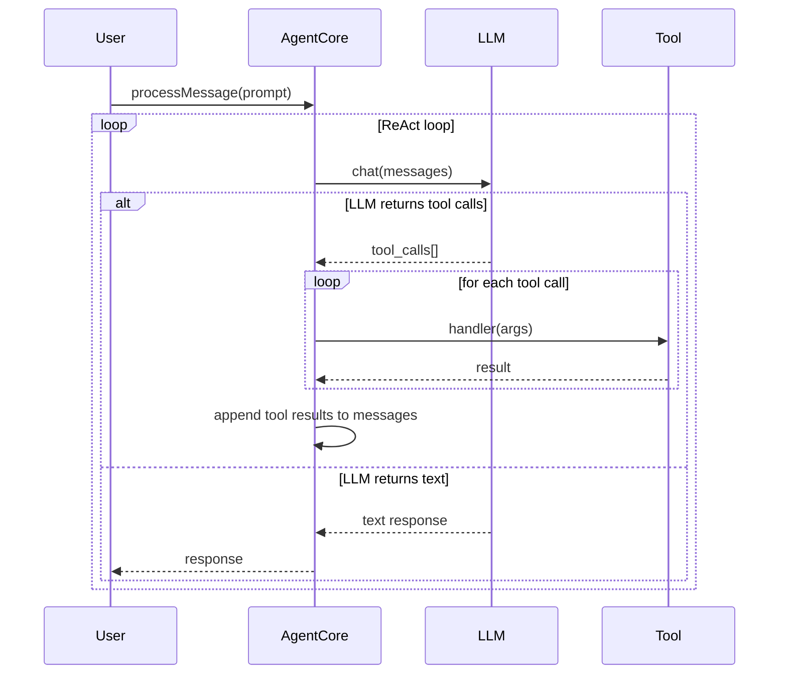
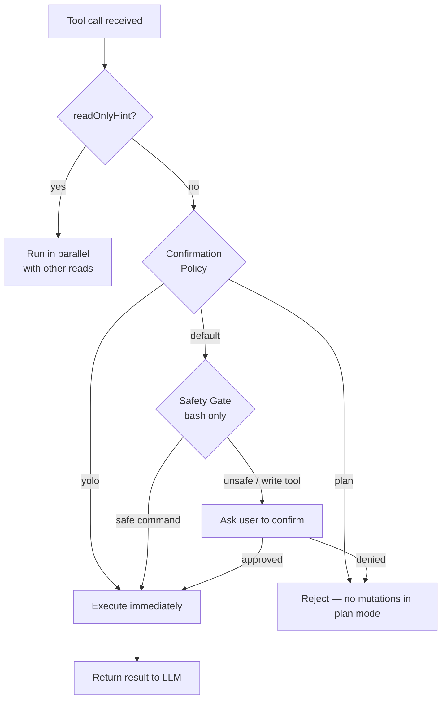
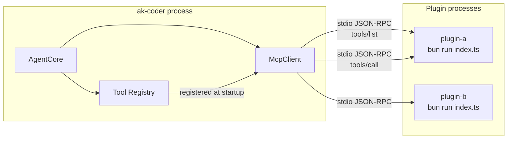
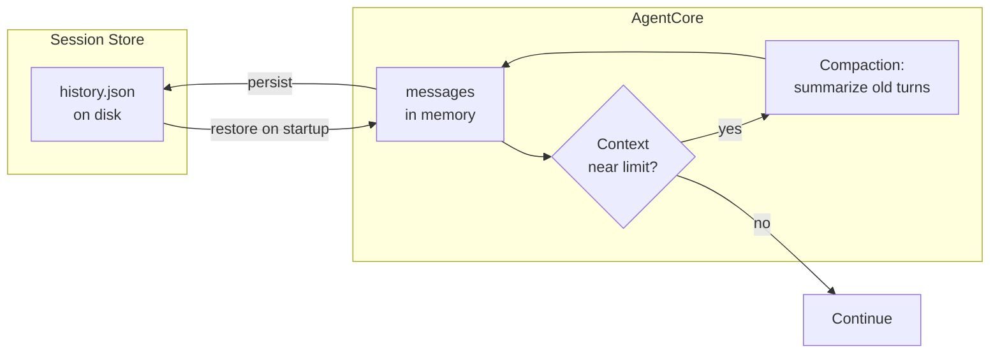
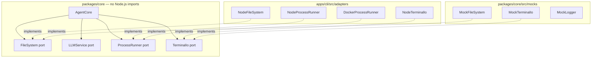

# System Flows

## Agent ReAct Loop

The core agent runs a ReAct (Reason + Act) loop: it sends messages to the LLM, which responds with either a final text answer or tool calls. Tool calls are executed and results fed back until the LLM produces a text response.

## Tool Execution & Confirmation

Before a write tool or bash command executes, it passes through the confirmation policy and (for bash) the safety gate.

## Plugin & MCP Architecture

Plugins are local MCP servers. AgentCore spawns them as child processes and communicates over stdio JSON-RPC.

## Session & Compaction

Sessions are stored to disk as JSON. When the context window nears its limit, AgentCore compacts older messages into a summary to preserve working memory.

## Hexagonal Architecture: Ports & Adapters

