# System Flows

## System Overview

ak-coder splits into a **CLI shell** (Ink UI, slash routing, tab completion) and a **hexagonal core** (agent loop, tools, skills, sessions, MCP). The core never imports Node.js — all I/O goes through ports implemented in `apps/cli/src/adapters`.

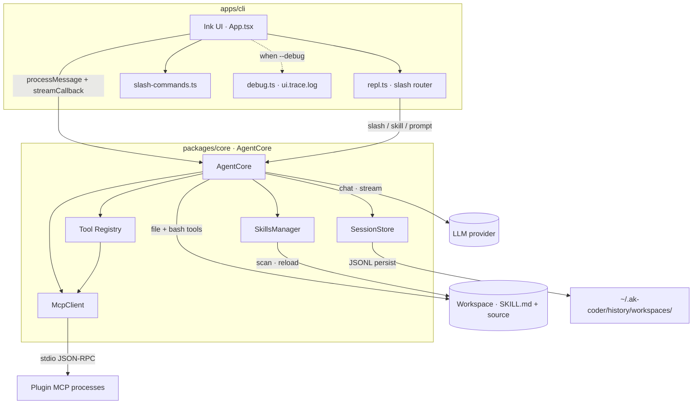

| Layer | Responsibility |
|-------|----------------|
| **Ink UI** | Render messages, stream tokens, permission prompts, working status |
| **Slash router** | Dispatch `/commands`, `/skills:<name>`, `!shell`, or agent prompts |
| **AgentCore** | ReAct loop, confirmation policy, compaction, child agents |
| **SkillsManager** | Discover `SKILL.md`, inject into system prompt, support reload |
| **SessionStore** | Workspace-scoped JSONL history, fork/resume |

---

## Agent ReAct Loop

The core agent runs a ReAct (Reason + Act) loop: it sends messages to the LLM, which responds with either a final text answer or tool calls. Tool calls are executed and results fed back until the LLM produces a text response.

Each turn, loaded skills are appended to the **system prompt** under an `Available Skills` section before the first LLM call.

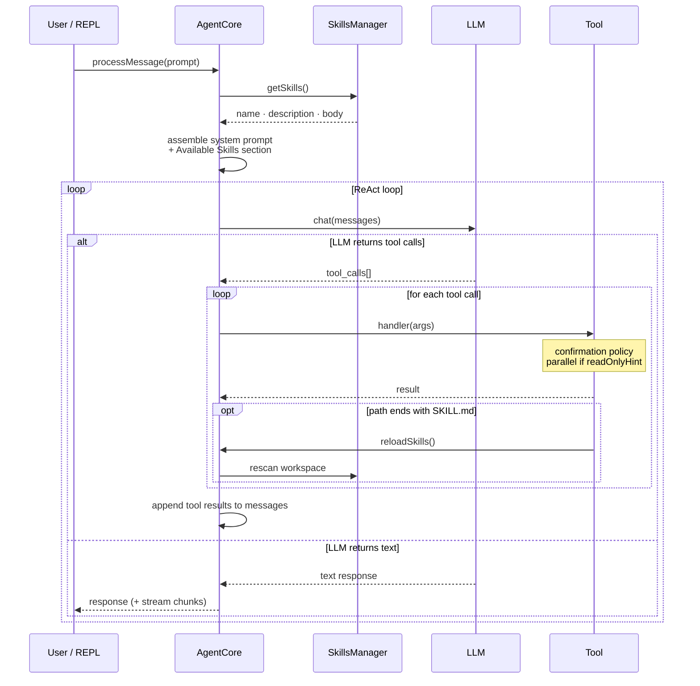

---

## REPL Input Routing

The Ink UI and legacy readline REPL share the same routing rules. Slash commands never reach the LLM unless they inject a skill or forward a prompt.

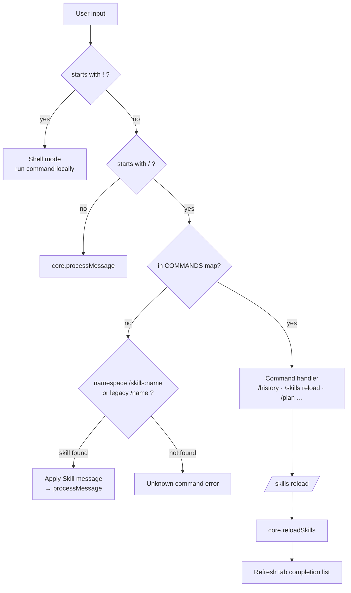

---

## Tool Execution & Confirmation

Before a write tool or bash command executes, it passes through the confirmation policy and (for bash) the safety gate.

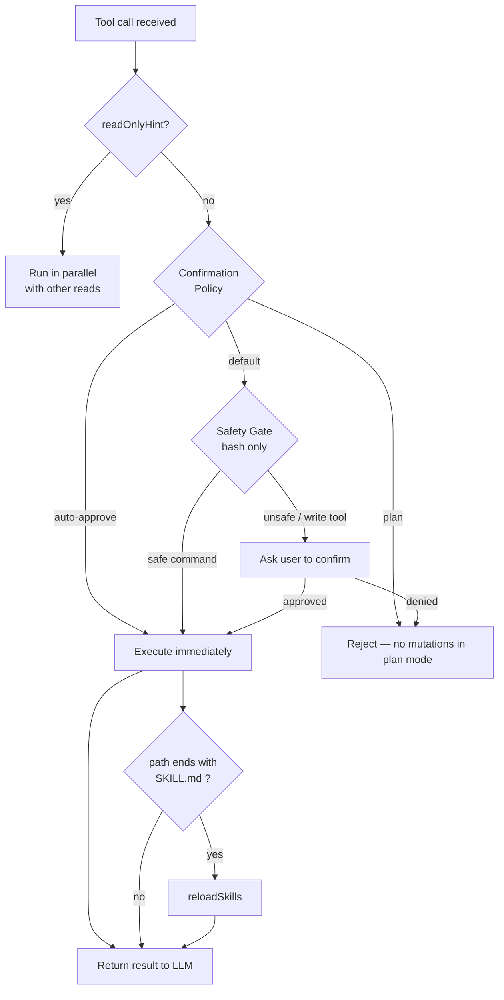

---

## Plugin & MCP Architecture

Plugins are local MCP servers. AgentCore spawns them as child processes and communicates over stdio JSON-RPC.

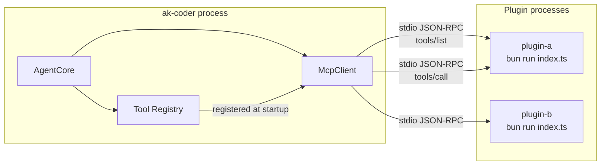

Lifecycle hooks (`beforeWriteFile`, `afterToolCall`, …) run inside the core tool handlers — see [ADR 03](/docs/adrs/plugin_system_hooks).

---

## Session & Compaction

Sessions are stored to disk as JSONL files under `~/.ak-coder/history/workspaces/<folder>-<hash>/`, scoped to the **current working directory** at startup. `/history` and `/resume` only show sessions for the folder you launched ak-coder from — not a global list across all projects.

When the context window nears its limit, AgentCore compacts older messages into a summary to preserve working memory.

Read-only tools with `readOnlyHint: true` run in parallel when batched — see [Tool Annotations](/docs/tools/annotations).

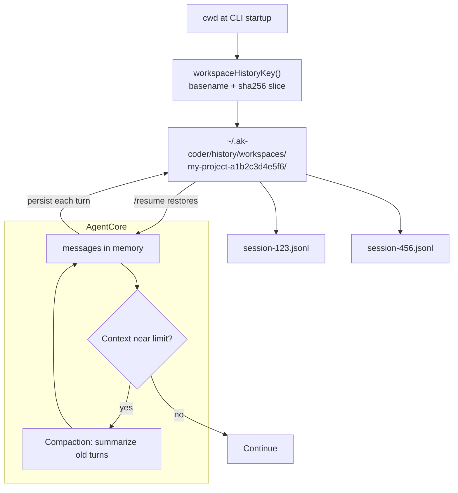

Legacy flat sessions in `~/.ak-coder/history/*.jsonl` (pre-0.1.8) are not listed when using workspace-scoped storage. Forking creates a new JSONL branch — see [ADR 06](/docs/adrs/session_forking).

---

## Skills: Discovery, Reload & Invocation

Skills are `SKILL.md` files discovered under the workspace root. They are injected into the system prompt each turn and invoked via `/skills:<name>`.

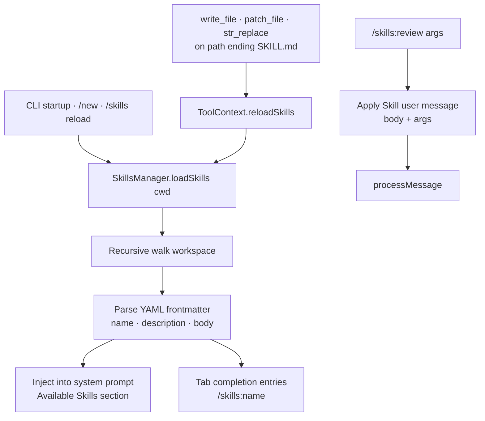

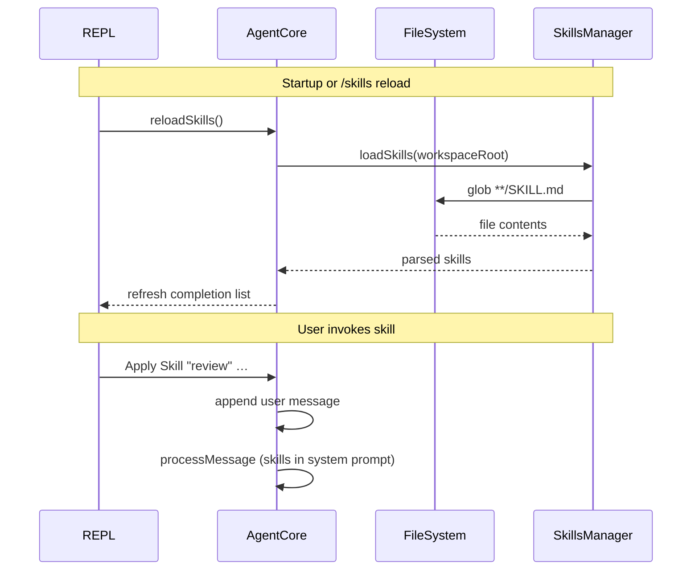

| Trigger | Effect |
|---------|--------|
| Startup, `/new`, `/skills reload` | Rescan workspace for `SKILL.md` files |
| Edit any `SKILL.md` via write tools | Auto-reload after successful save |
| `/skills:<name>` | Inject skill instructions as a user message |

See [Skills](/docs/plugins/skills) and [ADR 04](/docs/adrs/skills_system).

---

## Slash Command Completion

The Ink REPL builds tab-completion from a **slash-command registry** (`apps/cli/src/slash-commands.ts`):

1. **Static commands** — derived from the `COMMANDS` map in `repl.ts` (`/help`, `/history`, …)
2. **Extensions** — dynamic entries registered via `registerSlashCommandExtension()`

The built-in **skills extension** adds `/skills reload` and one entry per loaded skill (`/skills:my-skill`). Typing `/skills` narrows to reload + all skill names; typing `/skills:` shows skill names only.

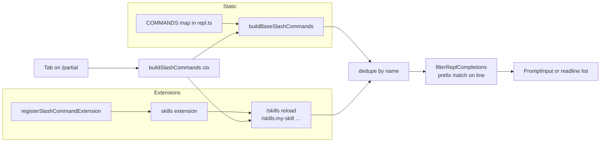

Extensions can be added for other namespaced commands (e.g. future MCP or plugin slash commands) without editing the base command map.

---

## Sub-agent Delegation

Complex tasks can spawn a **child AgentCore** via `delegate_task` or `/agent <role> | <task>`. The child shares ports (filesystem, LLM, process runner) but gets an isolated message history and optional file context.

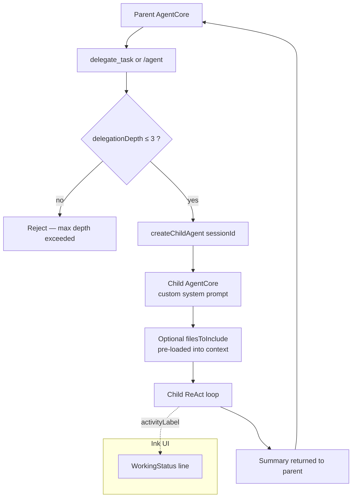

See [ADR 10](/docs/adrs/subagent_task_delegation).

---

## Streaming & Debug

The Ink UI streams assistant text and optional **thinking/reasoning** blocks (models that emit channel tags or reasoning deltas). A pinned **working status** line above the prompt shows active tool or sub-agent activity while tools run.

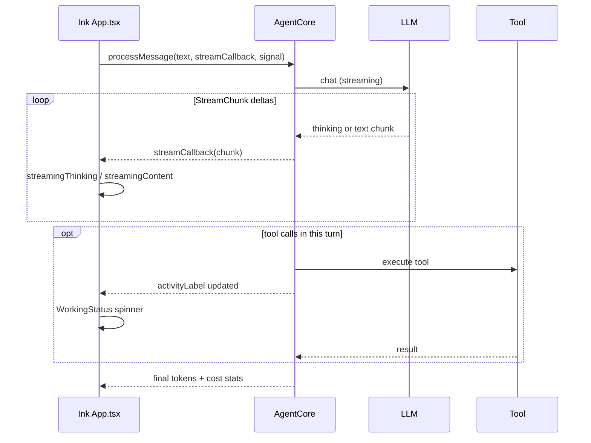

Enable trace logging with `--debug` or `AK_CODER_DEBUG=1`:

| Output | Contents |
|--------|----------|
| `~/.ak-coder/logs/ui.trace.log` | UI events (activity, sub-agents, stream phases) |
| `~/.ak-coder/logs/agent.log` | Core agent log (tool start/finish at debug level) |

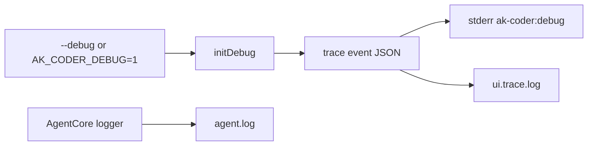

```bash
ak-coder --debug
tail -f ~/.ak-coder/logs/ui.trace.log
```

---

## Hexagonal Architecture: Ports & Adapters

```mermaid
graph TB
    subgraph Core ["packages/core — no Node.js imports"]
        AG[AgentCore]
        SM[SkillsManager]
        subgraph Ports
            FS_P[FileSystem]
            LLM_P[LLMService]
            PR_P[ProcessRunner]
            TIO_P[TerminalIo]
            SS_P[SessionStore]
            LOG_P[Logger]
        end
        AG --> SM
        AG --> FS_P & LLM_P & PR_P & TIO_P & SS_P & LOG_P
    end

    subgraph CLI ["apps/cli/src/adapters"]
        NFS[NodeFileSystem]
        NTI[NodeTerminalIo]
        NPR[NodeProcessRunner]
        DPR[DockerProcessRunner]
        FSS[FileSessionStore]
    end

    subgraph Test ["packages/core/src/mocks"]
        MFS[MockFileSystem]
        MTI[MockTerminalIo]
        MLG[MockLogger]
    end

    NFS -.->|implements| FS_P
    NTI -.->|implements| TIO_P
    NPR & DPR -.->|implements| PR_P
    FSS -.->|implements| SS_P
    MFS -.->|implements| FS_P
    MTI -.->|implements| TIO_P
```

The CLI wires adapters in `apps/cli/src/index.ts`: workspace root → history dir, LLM provider, process runner (host or Docker sandbox), and optional debug logging.

See [ADR 01](/docs/adrs/hexagonal_architecture).
